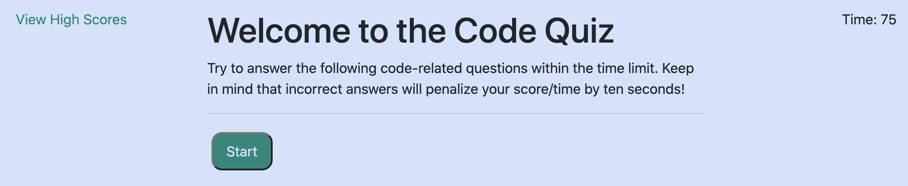
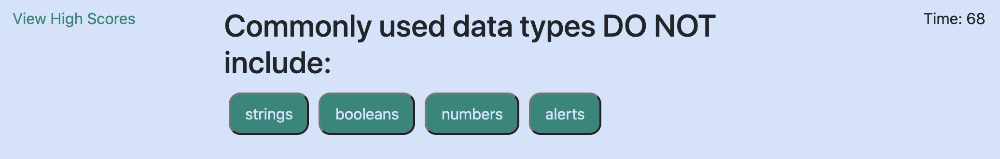
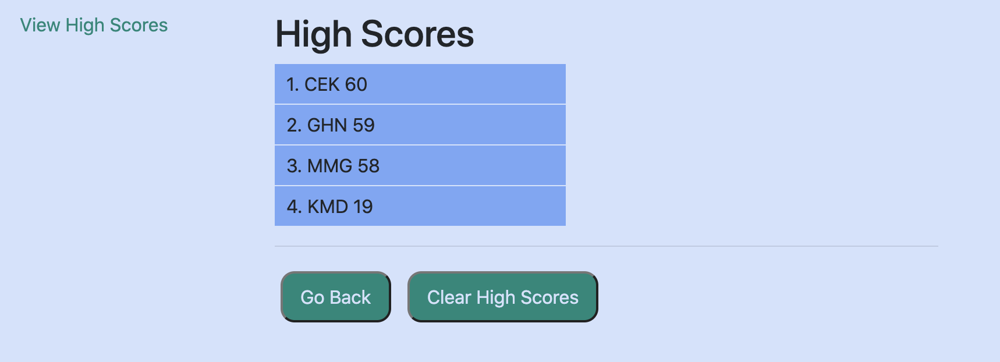

# CodeQuiz

## Deployed

[Access the deployed web application here.](https://christinakerr.github.io/CodeQuiz/)

## Purpose

This application tests the user's knowledge of JavaScript fundamentals, then saves high scores locally to compare with other players in the same browser. The quiz is timed, starting at 75 seconds, and players' scores are determined by the amount of time remaining at the end. Incorrect answers subtract 10 seconds.

## Tech

This application leverages: 

* HTML
* CSS
* JavaScript
* Bootstrap

